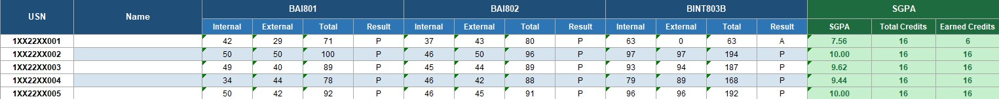

# VTU Results Scraper

### This tool automates the entire process.

Give it a list of USNs.

It will:

✅ Open the VTU Results Portal

✅ Solve captchas automatically using AI

✅ Download student marks

✅ Calculate SGPA

✅ Generate Excel reports

✅ Create a professional PDF summary

✅ Resume automatically if interrupted

---

# What You Get (Outputs)

### Excel Workbook

Complete marks data with:

* Internal marks
* External marks
* Total marks
* Result status
* SGPA
* Separate semester sheets
* Backlog tracking

---

### Faculty/HOD PDF Report

Automatically generated report containing:

* Overall class performance
* Pass percentage
* Average SGPA
* Top performers
* Subject-wise analysis
* Student rankings
* Auto-generated insights

---

## Example Outputs

### Dashboard Report


---

### Excel Results Workbook



---

### Subject-wise Analysis


---

### Student Rankings


---

# How Much Time Does It Save?

| Task                     | Manual        | Using This Tool |
| ------------------------ | ------------- | --------------- |
| Check 60 Student Results | 1–2 Hours     | 3-5 minutes     |
| Calculate SGPA           | 20–30 Minutes | 1 minute        |
| Prepare Excel Sheet      | 30–60 Minutes | 1 minute        |
| Create Summary Report    | 20–30 Minutes | 1 minute        |

### Over all time taken

**5-7 minutes per batch**

---

# Quick Start (5 Minutes)

## Step 1: Download the Project

### Option A — Download ZIP

1. Star the project.
2. Click the green **Code** button.
3. Select **Download ZIP**.
4. Extract the ZIP file.

### Option B — Clone Using Git

```bash
git clone https://github.com/YOUR_USERNAME/vtu-results-scraper.git
cd vtu-results-scraper
```

---

## Step 2: Install Python

Download Python:

https://www.python.org/downloads/

Verify installation:

```bash
python --version
```

Python 3.10 or newer is recommended.


## Step 3: Download ChromeDriver

Download ChromeDriver matching your Chrome version:

https://chromedriver.chromium.org/downloads

Place it in the project folder.

---

## Step 4: Install Dependencies

Open Command Prompt or Terminal inside the project folder.

Run:

```bash
pip install selenium pandas openpyxl beautifulsoup4 tensorflow opencv-python pillow reportlab matplotlib
```

---

## Step 5: Add Your USN List

Create:

```text
Inp-Out/usn_list.xlsx
```

The Excel file must contain a column named:

```text
USN
```

Example:

| USN        |
| ---------- |
| 1AM22AI001 |
| 1AM22AI002 |
| 1AM22AI003 |

---

## Step 6: Run

```bash
python main.py
```

Choose:

```text
Available schemes : ['2022', '2025']
Enter scheme year : 2022

Available semesters : [1,2,3,4,5,6,7,8]
Enter semester number : 5
```

That's it.

The scraper starts automatically.

---

# Live Progress Tracking

While running, you'll see:

```text
[████████████░░░░░░░░] 60%

12/20

✓11 Passed
✗1 Failed

ETA 00:01:24

Currently Scraping:
1AM22AI067
```

---

# Generated Files

After completion:

```text
Inp-Out/

├── vtu_results.xlsx
├── vtu_results_report.pdf
├── failed_usns.txt
├── scraper.log
└── checkpoint.txt
```

---

# Smart Resume Feature

Power cut?

Chrome crash?

Internet failure?

No problem.

When restarted:

```bash
python main.py
```

The program detects the last completed student automatically.

```text
Previous session detected.

Resume from where you left off? [Y/n]
```

Press:

```text
Y
```

and continue.

No re-scraping required.

---

# AI-Powered Captcha Solver

The VTU portal requires captcha verification.

This project includes a trained OCR model that automatically solves captchas during scraping.

### Benefits

* No manual captcha entry
* Fully automated execution
* Faster processing
* Higher throughput

---

# Project Structure

```text
vtu_results/

├── Inp-Out/
│   ├── usn_list.xlsx
│   ├── vtu_results.xlsx
│   └── vtu_results_report.pdf
│
├── crnn_10_prediction_model.keras
│
├── main.py
├── browser.py
├── scraper.py
├── exporter.py
├── report.py
├── sgpa.py
├── checkpoint.py
├── ocr.py
├── config.py
│
├── checkpoint.txt
├── scraper.log
└── failed_usns.txt
```

---

# If any error or issue occurs, look into the 'scraper.log' file. It has a detailed log of things happening. 

---

# Common Questions

### Is this free?

Yes.

This project is completely open source.

---

### Do I need programming knowledge?

No.

If you can:

1. Download a ZIP file
2. Open a terminal
3. Run one command

you can use this tool.

---

### Can I use it for an entire class?

Yes.

The tool is designed for batch processing.

---

### What happens if some USNs fail?

Failed entries are saved automatically in:

```text
failed_usns.txt
```

You can rerun only those students later.

---

### Does it calculate SGPA automatically?

Yes.

SGPA is calculated and added to the Excel output automatically.

---

# Roadmap

Planned features:

* CGPA calculation
* Multi-semester analytics
* Branch comparison reports
* Department-wide dashboards
* GUI version (No terminal required)
* One-click executable release

---

# Contributing

Contributions are welcome.

Feel free to:

* Open issues
* Submit pull requests
* Suggest features
* Improve documentation

---

# Support the Project

If this project saved you time:

⭐ Star this repository

🍴 Fork it

📢 Share it with other VTU faculty members

Every star helps the project reach more educators.

---